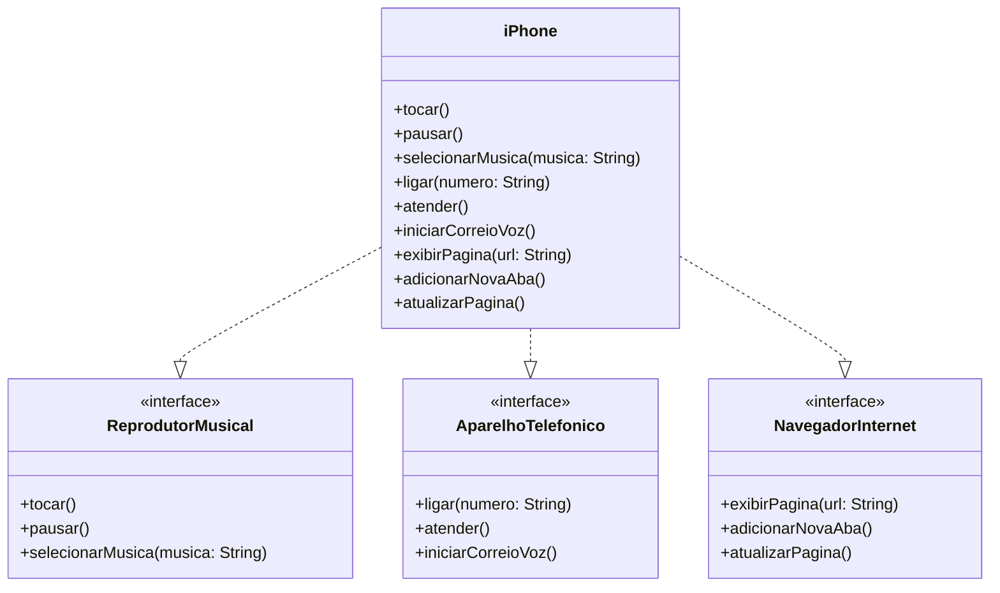

# Projeto iPhone

Este projeto implementa um modelo de classes em Java para simular as funcionalidades de um iPhone. Ele utiliza interfaces para representar diferentes funcionalidades e uma classe principal (`iPhone`) que implementa todas essas interfaces.

## Diagrama de Classes



## Estrutura do Projeto

O projeto é composto por:

- **Interfaces**:
  - `ReprodutorMusical`: Define métodos relacionados à reprodução de músicas.
  - `AparelhoTelefonico`: Define métodos relacionados a funcionalidades de telefone.
  - `NavegadorInternet`: Define métodos relacionados à navegação na internet.
- **Classe Principal**:
  - `iPhone`: Implementa todas as interfaces e centraliza as funcionalidades.

## Funcionalidades

### Reprodutor Musical

- `tocar()`: Reproduz uma música.
- `pausar()`: Pausa a música em reprodução.
- `selecionarMusica(String musica)`: Seleciona uma música específica.

### Aparelho Telefônico

- `ligar(String numero)`: Realiza uma ligação para o número especificado.
- `atender()`: Atende uma chamada.
- `iniciarCorreioVoz()`: Inicia o correio de voz.

### Navegador de Internet

- `exibirPagina(String url)`: Exibe uma página da web.
- `adicionarNovaAba()`: Adiciona uma nova aba no navegador.
- `atualizarPagina()`: Atualiza a página atual.

## Como Executar

1. Certifique-se de ter o Java instalado em sua máquina.
2. Compile os arquivos `.java` usando o comando em _Linux_:

   ```bash
   javac *.java
   ```

<details align="left">
  <summary>Desafio Proposto</summary>

# [DIO](www.dio.me) - Trilha Java Básico

## Autores

- [Gleyson Sampaio](https://github.com/glysns)

## POO - Desafio

### Modelagem e Diagramação de um Componente iPhone

Neste desafio, você será responsável por modelar e diagramar a representação UML do componente iPhone, abrangendo suas funcionalidades como Reprodutor Musical, Aparelho Telefônico e Navegador na Internet.

#### Contexto

Com base no vídeo de lançamento do iPhone de 2007 (link abaixo), você deve elaborar a diagramação das classes e interfaces utilizando uma ferramenta UML de sua preferência. Em seguida, implemente as classes e interfaces no formato de arquivos `.java`.

[Lançamento iPhone 2007](https://www.youtube.com/watch?v=9ou608QQRq8)

- Minutos relevantes: 00:15 até 00:55

#### Funcionalidades a Modelar

1. **Reprodutor Musical**
   - Métodos: `tocar()`, `pausar()`, `selecionarMusica(String musica)`
2. **Aparelho Telefônico**
   - Métodos: `ligar(String numero)`, `atender()`, `iniciarCorreioVoz()`
3. **Navegador na Internet**
   - Métodos: `exibirPagina(String url)`, `adicionarNovaAba()`, `atualizarPagina()`

### Objetivo

1. Criar um diagrama UML que represente as funcionalidades descritas acima.
2. Implementar as classes e interfaces correspondentes em Java (Opcional).

</details>
